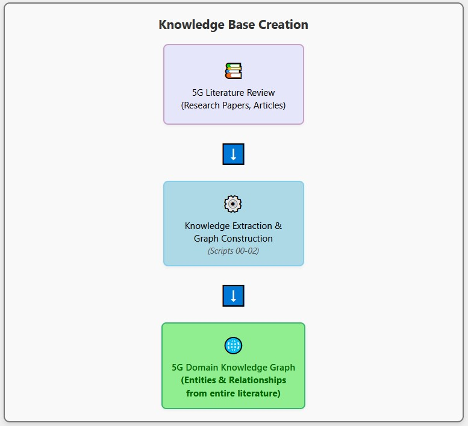
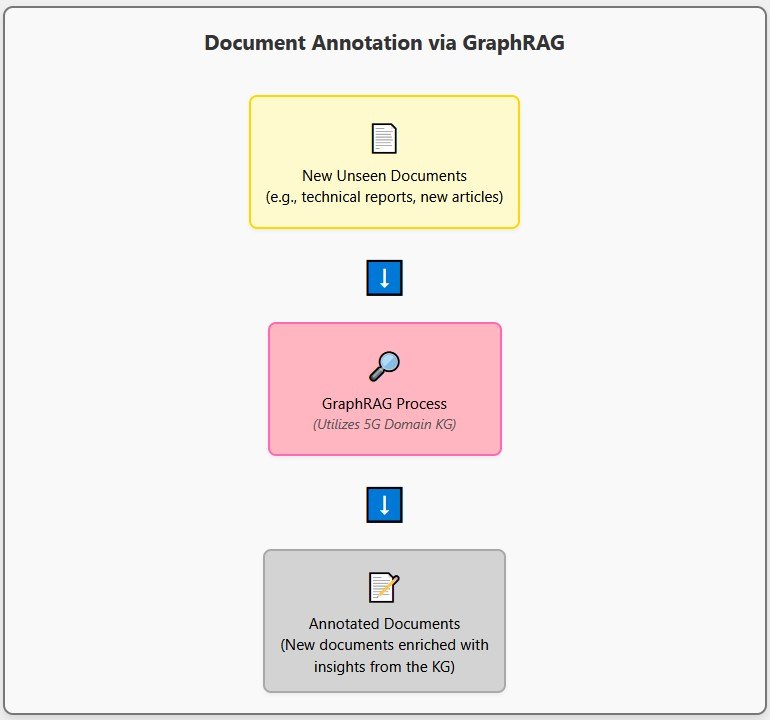

# GraphRAG Literature Review & Knowledge Extraction Pipeline

Implements a GraphRAG pipeline for knowledge extraction and document annotation. This repository converts a literature review into a structured knowledge graph, facilitating semantic enrichment of incoming documents.

## Description

### Automated Knowledge Graph Construction from 5G Scientific Literature
#### Overview

This project implements a workflow for the automated extraction of structured knowledge (entities and their relationships) from unstructured scientific literature, specifically focusing on 5G communication systems literature reviews. It leverages a powerful Large Language Model (LLM) to parse textual content and generate a structured representation of information, forming the foundation for a domain-specific knowledge graph.

The core idea is to transform raw text chunks from PDF documents into actionable, interconnected data points, enabling researchers and analysts to quickly grasp key concepts, identify relationships, and gain insights from large volumes of academic papers that would otherwise be time-consuming to process manually.


## Knowledge Extraction Pipeline



This project includes a 3-step Python pipeline to process the literature:

**Step 1: PDF Text Extraction and Chunking**
* **Script:** `00_extract_chunck_from_pdf.py`
* **Functionality:**
    * Reads PDF files from the specified input directory (`data_Rag_litt_rev/`).
    * Uses `pypdf` to extract raw text content from each page.
    * Employs `llama_index.core.node_parser.SentenceSplitter` to divide the extracted text into manageable, overlapping chunks (default chunk size: 512, overlap: 50).
* **Output:** A Python pickle file (`dict_extracted_chunks_pdfs.pkl`) containing a dictionary where keys are PDF filenames and values are lists of text chunks. This file is saved in the input PDF directory.

**Step 2: Entity and Relationship Extraction with LLM**
* **Script:** `01_extract_entities_from_lit_review.py`
* **Functionality:**
    * Loads the text chunks generated in Step 1.
    * Transforms these chunks into `llama_index.core.Document` objects.
    * Utilizes a Large Language Model (LLM) via `llama-index` (configurable for Groq using 'deepseek-r1-distill-llama-70b' or potentially Ollama) to extract entities and their relationships from each text chunk.
    * A custom system prompt guides the LLM to identify binary relationships relevant to 5G communication systems and electrical engineering, focusing on lemmatized, singular entities and infinitive verb relationships.
    * The extracted information is stored within the metadata of the LlamaIndex nodes.
* **Dependencies:** Requires a `GROQ_API_TOKEN` environment variable if using the Groq API. Custom modules `KG_Extractor.py` and `customTools.py` are used.
* **Output:** An updated list of LlamaIndex nodes (with LLM responses in metadata) saved as a pickle file (e.g., `nodes_lit_rev_with_KG_YYYY-MM-DD.pkl`) in the `data_nodes/` directory.

**Step 3: Entity Normalization**
* **Script:** `02_normalize_entities.py`
* **Functionality:**
    * Loads the nodes containing the LLM-extracted entities and relationships.
    * Parses the LLM's output using a custom `ParserLLM_KG_extracted_output` (from `Parsers.py`).
    * Collects all unique entities.
    * Employs a custom `EntityNormalizer` (from `EntityNormalizer.py`) which uses spaCy ('en_core_web_lg') and sentence-transformer embeddings ('all-MiniLM-L6-v2') to cluster similar entities based on semantic similarity (cosine distance, average linkage).
    * Creates a mapping from original extracted entities to their normalized (canonical) forms (default distance threshold for clustering: 0.20).
    * Updates the relationships in the nodes' metadata to use these normalized entities.
* **Dependencies:** Custom modules `EntityNormalizer.py` and `Parsers.py`. Requires spaCy model and sentence-transformer model (will be cached in `models_cache_folder/`).
* **Output:** A final list of LlamaIndex nodes with normalized, structured relationships saved as a pickle file (e.g., `nodes_lit_rev_with_KG_normalzed_embed_YYYY-MM-DD.pkl`) in the `data_nodes/` directory.


## Document Annotation with RAG



This part is under developement


## Prerequisites

* Python 3.x
* PIP (Python package installer)
* `GROQ_API_TOKEN` environment variable (if using Groq LLM)
* (If using Ollama) Ollama installed and running with the necessary models pulled (e.g., 'deepseek-r1:32b').

## Setup & Installation

1.  **Clone the repository:**
    ```bash
    git clone [https://github.com/puli83/GraphRag_literature_review.git](https://github.com/puli83/GraphRag_literature_review.git)
    cd GraphRag_literature_review
    ```

2.  **Create and activate a virtual environment (recommended):**
    ```bash
    python -m venv venv
    source venv/bin/activate  # On Windows use `venv\Scripts\activate`
    ```

3.  **Install dependencies:**
    It's highly recommended to create a `requirements.txt` file. Based on the scripts, it should include at least:
    ```
    pypdf
    llama-index-core
    llama-index-llms-groq
    # llama-index-llms-ollama # Uncomment if you plan to use Ollama
    # pandas # Imported in 01, ensure it's needed
    # tqdm # Imported in 01, ensure it's needed
    # networkx # Imported in 01, ensure it's needed
    spacy
    sentence-transformers
    scikit-learn # Likely a dependency of EntityNormalizer for clustering
    # Add any other specific versions if necessary
    ```
    Then run:
    ```bash
    pip install -r requirements.txt
    ```

4.  **Download spaCy model:**
    ```bash
    python -m spacy download en_core_web_lg
    ```

5.  **Set up API Keys:**
    If using Groq, ensure the `GROQ_API_TOKEN` environment variable is set:
    ```bash
    export GROQ_API_TOKEN="your_actual_groq_api_key"
    ```
    (Add this to your `.bashrc`, `.zshrc`, or environment variables for persistence).

6.  **Create necessary directories:**
    Ensure the following directories exist in the root of your project, or update the path variables in the scripts:
    * `data_Rag_litt_rev/`: Place your input PDF files here.
    * `data_nodes/`: This will store intermediate and final processed node data.
    * `models_cache_folder/`: This will be used by `sentence-transformers` to cache downloaded embedding models.

## Usage

Run the scripts in sequence:

1.  **Extract text chunks from PDFs:**
    ```bash
    python 00_extract_chunck_from_pdf.py
    ```
    * Ensure your PDF files are in the `data_Rag_litt_rev/` directory.
    * Output: `data_Rag_litt_rev/dict_extracted_chunks_pdfs.pkl`

2.  **Extract entities and relationships:**
    ```bash
    python 01_extract_entities_from_lit_review.py
    ```
    * This script uses the output from step 1.
    * Ensure your LLM (Groq/Ollama) is configured correctly.
    * Output: `data_nodes/nodes_lit_rev_with_KG_YYYY-MM-DD.pkl`

3.  **Normalize extracted entities:**
    ```bash
    python 02_normalize_entities.py
    ```
    * This script uses the output from step 2.
    * Make sure the filename in `02_normalize_entities.py` (e.g., `nodes_lit_rev_with_KG_2025-05-12.pkl`) matches an output file from the previous step.
    * Output: `data_nodes/nodes_lit_rev_with_KG_normalzed_embed_YYYY-MM-DD.pkl`

## Configuration

Key parameters that can be configured within the scripts:

* **`00_extract_chunck_from_pdf.py`**:
    * `pth_import`: Path to the directory containing PDFs.
    * `CHUNK_SIZE`, `CHUNK_OVERLAP`: Parameters for text chunking.
* **`01_extract_entities_from_lit_review.py`**:
    * `pth_import`, `pth_nodes`: Input/output paths.
    * LLM model name (e.g., `model='deepseek-r1-distill-llama-70b'` for Groq).
    * LLM parameters (temperature, context window, etc.).
    * `SYSTEM_PROMPT`: The prompt guiding the LLM for entity/relationship extraction.
    * `max_requests_per_minute` for the `EntityExtractor`.
* **`02_normalize_entities.py`**:
    * `pth_nodes`: Input/output path.
    * `spacy_model_name`, `embedding_model_name` for `EntityNormalizer`.
    * `linkage_method`, `linkage_metric`, `distance_threshold` for entity clustering and normalization.

## Custom Modules

This project relies on several custom Python modules :

* `KG_Extractor.py`: Contains the `EntityExtractor` class used in script `01` for interacting with the LLM to extract structured information.
* `EntityNormalizer.py`: Contains the `EntityNormalizer` class used in script `02` for cleaning and consolidating extracted entities using embeddings and clustering.
* `Parsers.py`: Contains the `ParserLLM_KG_extracted_output` class used in script `02` to parse the raw text output from the LLM into a more structured format.
* `customTools.py`: Contains utility functions like `TimeExecution` and `clear_gpu_memory`.


# License

MIT License

# Contact

Davide Pulizzotto, Polytechnique Montréal - [mail](davide.pulizzotto@polymtl.ca)

Project Link: [link](https://github.com/puli83/GraphRag_literature_review)
